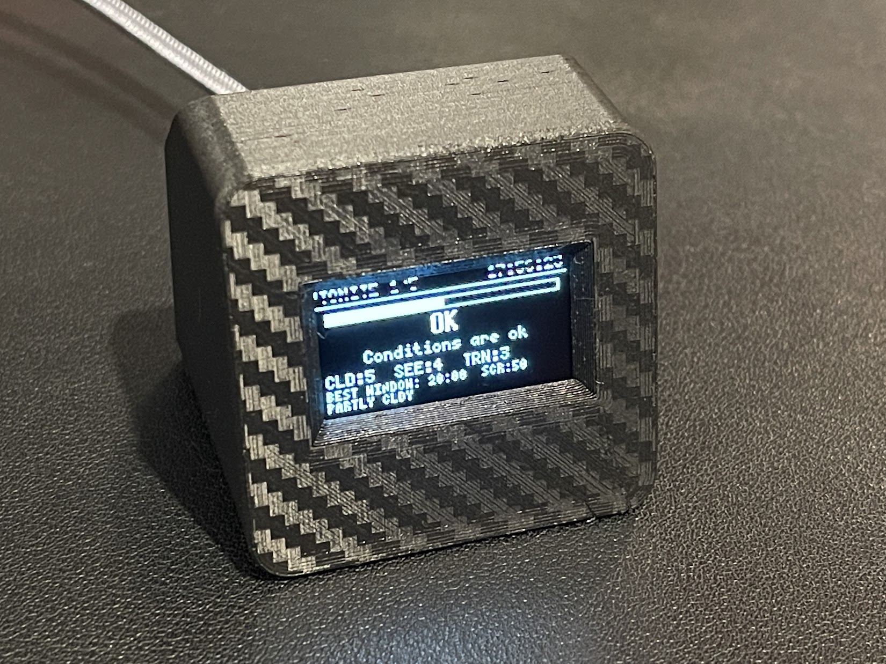

# Astro Sky Conditions Monitor

A standalone ESP8266 device that fetches real-time astronomy weather forecasts and displays them on a 1.3" OLED screen. At a glance it tells you whether tonight is worth setting up your telescope.



---

## Hardware

| Component | Details | Shop |
|-----------|---------|------|
| Microcontroller | ESP8266 (FREENOVE ESP8266 / NodeMCU ESP-12E or similar) | https://www.amazon.com.au/dp/B0B6G3KXSK |
| Display | 1.3" SH1106 I2C OLED, 128×64 pixels | https://www.amazon.com.au/dp/B0DX2NXK49 |
| 3D Printed case | Just a recommendation | https://cults3d.com/en/3d-model/gadget/1-3-inch-oled-wemos-d1-mini-esp8266-display |

### Wiring

| OLED Pin | ESP8266 GPIO | NodeMCU/D1 Mini Label | FREENOVE ESP8266 Board Label |
|----------|--------------|------------------------|-------------------------------|
| GND | — | GND | GND |
| VCC | — | 3V3 | 3V3 |
| SCL | GPIO5 | D1 | 5 |
| SDA | GPIO4 | D2 | 4 |

---

## Software Setup

### 1. Arduino IDE Board Settings

- **Board:** NodeMCU 1.0 (ESP-12E Module)
- **Upload Speed:** 115200
- **Flash Size:** 4MB (FS:2MB OTA:~1019KB) — must include a filesystem partition for LittleFS

Add the ESP8266 board package URL if you haven't already:
```
https://arduino.esp8266.com/stable/package_esp8266com_index.json
```

### 2. Libraries

Install all from **Sketch → Include Library → Manage Libraries**:

| Library | Author | Version |
|---------|--------|---------|
| U8g2 | olikraus | latest |
| ArduinoJson | Benoit Blanchon | 7.x |
| WiFiManager | tzapu | latest |

### 3. Configuration

`config.h` only holds fallback defaults now (location, timezone, display timing) — WiFi credentials aren't stored in code at all. You can leave it as-is and set everything up from the device itself; see **WiFi & Location Setup** below.

```cpp
#define HOME_LAT       -27.65973   // your latitude
#define HOME_LON       152.88028   // your longitude
#define TIMEZONE       "AEST-10"   // your POSIX timezone string
```

Find your coordinates at https://www.latlong.net

For other timezone strings, see:
https://github.com/nayarsystems/posix_tz_db/blob/master/zones.csv

---

## WiFi & Location Setup

The device configures itself over WiFi — no code editing or re-flashing needed to change network, location, timezone or screen rotation time.

**First boot:** the OLED will show "SETUP MODE". From your phone or laptop, join the WiFi network **`AstroMonitor-Setup`**, and a setup page should open automatically (if not, browse to `192.168.4.1`). Pick your home WiFi network and enter its password, plus your latitude, longitude, POSIX timezone string, and how long each screen should stay up before rotating to the next one ("Screen rotation time", in seconds — defaults to 10), then save. The device reboots and connects.

If the WiFi password you entered doesn't work, the OLED shows "WIFI FAILED / Could not connect to that network / Reopening setup..." and the portal automatically reopens after a few seconds so you can try again — you don't need to press the button again.

**To change settings later** (new WiFi network, moved house, etc.): while the device is running normally (showing the rotating screens), press the board's **FLASH button** (the unlabelled one next to the USB port, wired to GPIO0 — not the RST button). The OLED will prompt you:
- **Release it right away** to just open the setup portal, pre-filled with your current WiFi/location/timezone as editable defaults — nothing is erased until you save. Once saved, the device restarts on its own to apply the new settings.
- **Keep holding it for 5+ seconds** to trigger a **factory reset** — this wipes the saved WiFi credentials and location/timezone completely, then restarts into a blank setup portal. Use this when handing the device to someone else or moving it to a new home network from scratch.

Note: this button only works when pressed *after* the device has already booted — don't hold it down while plugging in power or pressing RST, since the ESP8266 checks that pin at the hardware level during an actual power-on/reset and will drop into a serial flashing mode instead of running normally (the display stays blank) if it's held low at that exact moment.

Settings are stored on the device (LittleFS for location/timezone, the ESP8266's own WiFi flash storage for network credentials) and survive power loss and re-uploading the sketch — until a factory reset explicitly clears them.

After connecting, the device automatically looks up a human-readable place name for your coordinates (e.g. "Brisbane") and shows it on the TONITE screen for confirmation that the location is right. If the lookup fails (or hasn't run yet), it falls back to showing "Location Unknown" — this doesn't affect forecasts, which are driven entirely by lat/lon.

---

## Data Sources

- **7Timer!** (https://www.7timer.info) — free public astronomy weather service based on NOAA/NCEP GFS numerical weather models. No API key required. Data is fetched every ~30 minutes and covers the next 72 hours in 3-hour slots.
- **BigDataCloud reverse geocoding** (https://www.bigdatacloud.net) — free, no API key required, used only to resolve your lat/lon into a place name for display. Called once when your location is first set or changed (the result is cached), not on a recurring schedule.

---

## Screens

The device rotates through 5 screens, each displayed for 6 seconds.

---

### Screen 1 — TONITE

**Overall go/no-go assessment for right now.**

```
TONITE 1/5                 21:04:33
             Brisbane
████████████████░░░░░░░░░░░░░░░░  ← score bar
        GOOD ENOUGH
      Conditions are good
CLD:5  SEE:6  TRN:4
BEST WINDOW: 23:00  SCR:82
FEW CLOUDS
```

**Score bar** — fills left to right from 0 to 100. The fuller it is, the better the conditions.

**Verdict** is one of five ratings:

| Verdict | Score | Meaning |
|---------|-------|---------|
| PERFECT | 85–100 | Exceptional night, ideal for imaging |
| GOOD ENOUGH | 65–84 | Good conditions, worth setting up |
| MARGINAL | 45–64 | Marginal but usable |
| DOUBTFUL | 25–44 | Poor conditions, probably not worth it |
| TERRIBLE | 0–24 | Bad conditions, stay inside |

**Score calculation** — weighted average of four factors:

| Factor | Weight | How it's scored |
|--------|--------|----------------|
| Cloud cover | 50% | 7timer scale 1–9, inverted (1=clear=100pts, 9=overcast=0pts) |
| Seeing | 25% | 7timer scale 1–8, direct (1=terrible=0pts, 8=excellent=100pts) |
| Transparency | 15% | 7timer scale 1–8, direct (same as seeing) |
| Lifted index | 10% | Atmospheric stability. ≥0 = stable = 100pts; negative = unstable |
| Precipitation | — | Any rain/snow automatically returns score of 0 regardless of other factors |

**BEST WINDOW** shows the highest-scoring 3-hour slot between 20:00 and 05:00 tonight, with its score and cloud description.

---

### Screen 2 — CLOUDS

**Bar chart of cloud cover for the next 18 hours (6 × 3-hour slots).**

```
CLOUDS 2/5                 21:04:33
 ┌──┐┌──┐┌──┐┌──┐┌──┐┌──┐ │OVC
 │  ││▓▓││▓▓││▓▓││  ││  │ │
 │▓▓││▓▓││▓▓││▓▓││  ││  │ │
 └──┘└──┘└──┘└──┘└──┘└──┘ │CLR
 20h 23h 02h 05h 08h 11h
 5/9 9/9 9/9 9/9 2/9 1/9
```

- **Taller bar = more cloud cover** (bad for astronomy)
- **Shorter bar = less cloud** (good for astronomy)
- The **CLR/OVC** labels on the right mark the top (overcast) and bottom (clear) of the scale
- Each bar label shows the **hour** and **cloud cover rating out of 9**

Cloud cover scale:
- 1 = Clear
- 2–3 = Few clouds / Mostly clear
- 4–5 = Partly cloudy
- 6–7 = Mostly cloudy
- 8–9 = Overcast

---

### Screen 3 — SEEING

**Atmospheric seeing and transparency — how steady and clear the air is.**

```
SEE RATING 3/5              21:04:33
SEE           6  /8  GOOD
TRANSPCY      5  /8  ABOVE AVG
STABILITY: +6              STABLE
TREND: 6  6  5  4  4
```

**Seeing** measures atmospheric turbulence. Poor seeing causes stars to twinkle and blur, reducing sharpness in long-exposure images. Scale 1–8:

| Rating | Label |
|--------|-------|
| 1 | Terrible |
| 2 | Bad |
| 3 | Poor |
| 4 | Below average |
| 5 | Average |
| 6 | Good |
| 7 | Very good |
| 8 | Excellent |

**Transparency** measures how clear the atmosphere is — how much light is absorbed by haze, humidity and dust. Same 1–8 scale as seeing.

**Lifted Index (LFT IDX)** measures atmospheric stability:
- **Positive (+)** = stable air = steady seeing = better for planetary/lunar imaging
- **Zero** = neutral
- **Negative (−)** = unstable air = turbulent seeing = harder to get sharp images

**SEE trend** shows seeing values for the next 5 × 3-hour slots.

---

### Screen 4 — CONDTNS

**Current surface conditions relevant to observing.**

```
CONDTNS 4/5               21:04:33
TEMP  12°C
WIND  NE 7km/h
HUM   65%
PREC  NONE
```

- **TEMP** — air temperature at 2m height (°C)
- **WIND** — direction and approximate speed. High wind causes vibration in mounts and can shake the telescope during long exposures
- **HUM** — relative humidity %. High humidity (>85%) risks dew forming on optics and mirrors
- **PREC** — precipitation type: NONE, rain, snow, etc.

---

### Screen 5 — FORECAST

**3-slot compact forecast table showing the next 9 hours.**

```
FORECAST 5/5              21:04:33
─────────────────────────────────
TIME  CLD  SEE  TRN  GO?
21:00   5    6    4   OK
00:00   2    7    6   GO
03:00   1    7    7   GO!
```

Columns:
- **TIME** — local time for that 3-hour slot
- **CLD** — cloud cover (1=clear → 9=overcast)
- **SEE** — seeing quality (1=terrible → 8=excellent)
- **TRN** — transparency (1=terrible → 8=excellent)
- **GO?** — quick verdict:

| Label | Meaning |
|-------|---------|
| GO! | Score ≥ 85, exceptional |
| GO | Score ≥ 65, good |
| OK | Score ≥ 45, marginal |
| DBT | Score ≥ 25, doubtful |
| NO | Score < 25, no go |
| RAIN | Precipitation detected |

---

## Adjusting behaviour

`SCREEN_DWELL_MS` is now editable from the setup portal ("Screen rotation time") — see **WiFi & Location Setup** above. The rest are compile-time only, in `config.h`:

| Setting | Default | Description |
|---------|---------|-------------|
| `SCREEN_DWELL_MS` | 10000 | Initial/fallback rotation time (ms) — overridden once set via the portal |
| `FETCH_INTERVAL_MS` | 1800000 | How often data is re-fetched (30 min) |
| `FETCH_RETRIES` | 3 | Retries if 7timer returns malformed JSON |

---

## Notes

- 7Timer! data updates every ~6 hours on their server, so fetching more often than every 30 minutes won't give fresher data
- The service occasionally returns malformed JSON — the built-in retry logic handles this automatically
- Data covers 72 hours ahead in 3-hour slots
- This project uses HTTP**S** to connect to 7timer with certificate verification disabled (acceptable for a public weather API with no sensitive data)
- If no forecast data has been fetched successfully yet, the device shows "Refreshing data" and retries every 10 seconds for the first 10 attempts, then backs off to retrying every 60 seconds with a "Retrying... try a power cycle if this persists" message. This is normal recovery behaviour after a fresh boot and usually resolves within a minute or two on its own.

---

## License

MIT — do whatever you like with it.
