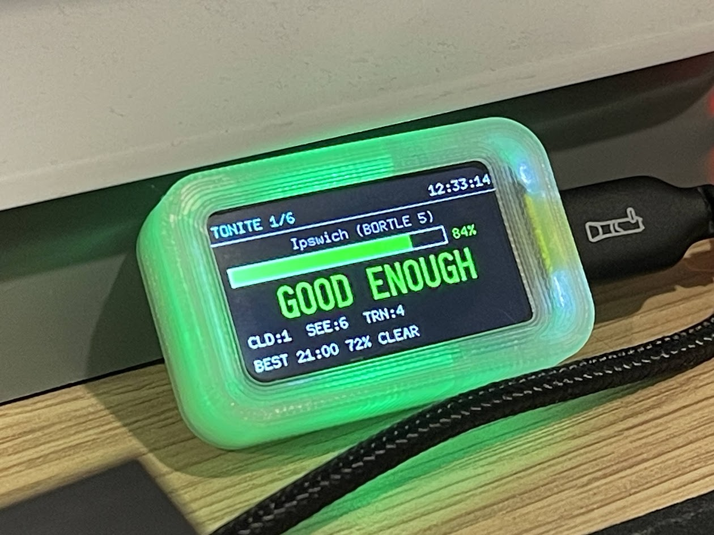

# Astro Sky Conditions Monitor

A standalone ESP32-C6 device that fetches real-time astronomy weather forecasts and displays them on a 1.47" color LCD. At a glance it tells you whether tonight is worth setting up your telescope.



---

## Hardware

| Component | Details | Shop |
|-----------|---------|------|
| Dev board | Waveshare ESP32-C6-LCD-1.47 (ESP32-C6FH4, 4MB flash, onboard 1.47" 172×320 ST7789 LCD, non-touch) | https://www.waveshare.com/esp32-c6-lcd-1.47.htm |

This is an all-in-one dev board — the LCD, its SPI wiring, the onboard RGB LED, and the BOOT/RESET buttons are already built onto the PCB, so there's nothing to wire up separately. The pin table below is just for reference (e.g. if you ever need to confirm a connection or adapt the sketch to a different ST7789 board).

### Onboard wiring (reference only — already connected on the board)

| Signal | ESP32-C6 GPIO |
|--------|---------------|
| LCD MOSI | GPIO6 |
| LCD SCLK | GPIO7 |
| LCD CS | GPIO14 |
| LCD DC | GPIO15 |
| LCD RST | GPIO21 |
| LCD Backlight (BLK) | GPIO22 |
| RGB status LED (WS2812) | GPIO8 |

The LCD is write-only (no MISO). The BOOT button used for the setup portal / factory reset is wired to GPIO9 — the same strapping-pin role GPIO0 plays on classic ESP8266/ESP32 boards.

---

## Software Setup

### 1. Arduino IDE Board Settings

Add the ESP32 board package URL if you haven't already (**File → Preferences → Additional boards manager URLs**):
```
https://raw.githubusercontent.com/espressif/arduino-esp32/gh-pages/package_esp32_index.json
```
Then install **esp32 by Espressif Systems** (version **3.0 or newer** — ESP32-C6 support requires it) from Boards Manager.

- **Board:** ESP32C6 Dev Module
- **Upload Speed:** 921600 (or 115200 if you get upload errors)
- **Flash Size:** 4MB (32Mb)
- **Partition Scheme:** **"Minimal SPIFFS (1.9MB APP with OTA/128KB SPIFFS)"** — the default 4MB/spiffs scheme's ~1.2MB app partition is too small for this sketch (WiFiManager + HTTPS + the display libraries land around 1.42MB compiled); Minimal SPIFFS gives 1.9MB of app space while still leaving a small filesystem partition for LittleFS to store the settings file
- **CPU Frequency:** 160MHz (default)

**Putting the board into upload mode:** unlike boards with auto-reset circuitry, this one needs a manual bootloader entry before each upload:
1. Hold down **BOOT**
2. Tap **RESET**
3. Release **BOOT**
4. Upload from the Arduino IDE
5. Press **RESET** again afterwards to run the sketch normally

### 2. Libraries

Install all from **Sketch → Include Library → Manage Libraries**:

| Library | Author | Version |
|---------|--------|---------|
| GFX Library for Arduino | moononournation | latest |
| U8g2 | olikraus | latest (used only for its bundled font data, rendered by Arduino_GFX) |
| Adafruit NeoPixel | Adafruit | latest (drives the onboard WS2812 status LED) |
| ArduinoJson | Benoit Blanchon | 7.x |
| WiFiManager | tzapu | latest |

### 3. Configuration

`config.h` only holds fallback defaults now (location, timezone, Bortle rating, display timing) — WiFi credentials aren't stored in code at all. You can leave it as-is and set everything up from the device itself; see **WiFi & Location Setup** below. Display pins, rotation, colors, fonts, and the status LED are fixed in `astro_monitor.ino` near the top (`PIN_LCD_*`, `PIN_RGB_LED`, `LCD_ROTATION`, `COL_*`, `FONT_*`) — only touch those if you're adapting the sketch to different hardware.

```cpp
#define HOME_LAT       -27.65973   // your latitude
#define HOME_LON       152.88028   // your longitude
#define HOME_BORTLE    5           // your Bortle scale rating, 1 (darkest) - 9 (brightest)
#define TIMEZONE       "AEST-10"   // your POSIX timezone string
```

Find your coordinates at https://www.latlong.net

Find your Bortle scale rating (light pollution, 1=darkest sky, 9=brightest/most light-polluted) at https://www.lightpollutionmap.net — click your location on the map. There's no free API for this (checked the obvious light-pollution map sites — all browser-only, no JSON endpoint), so unlike lat/lon and place-name, it's a one-time manual lookup rather than something the device resolves on its own.

For other timezone strings, see:
https://github.com/nayarsystems/posix_tz_db/blob/master/zones.csv

**If the screen comes up upside-down:** change `LCD_ROTATION` from `1` to `3` near the top of `astro_monitor.ino` and re-upload.

---

## WiFi & Location Setup

The device configures itself over WiFi — no code editing or re-flashing needed to change network, location, timezone, Bortle rating or screen rotation time.

**First boot:** the screen will show "SETUP MODE". From your phone or laptop, join the WiFi network **`AstroMonitor-Setup`**, and a setup page (dark themed, via a full-page CSS invert) should open automatically (if not, browse to `192.168.4.1`). Pick your home WiFi network and enter its password, plus your latitude, longitude, POSIX timezone string, your Bortle scale rating (1–9, with a link to look it up), and how long each screen should stay up before rotating to the next one ("Screen rotation time", in seconds — defaults to 10), then save. The device reboots and connects.

If the WiFi password you entered doesn't work, the screen shows "WIFI FAILED / Could not connect to that network / Reopening setup..." and the portal automatically reopens after a few seconds so you can try again — you don't need to press the button again.

**The BOOT button while running normally** (showing the rotating screens) has three gestures, shown on-screen the moment you press it:
- **Single click** (press and release right away) — jumps straight to the TONITE screen and restarts the rotation timer from there.
- **Double-click** — opens the setup portal, pre-filled with your current WiFi/location/timezone/Bortle rating as editable defaults — nothing is erased until you save. Once saved, the device restarts on its own to apply the new settings. (Telling single- from double-click apart needs a short ~400ms pause after release before either action fires — that's the button-debounce window, in `DOUBLE_CLICK_WINDOW_MS`.)
- **Hold for 5+ seconds** — triggers a **factory reset**, wiping the saved WiFi credentials and location/timezone/Bortle rating completely, then restarting into a blank setup portal. Use this when handing the device to someone else or moving it to a new home network from scratch.

Note: this button only works when pressed *after* the device has already booted — don't hold it down while plugging in power or pressing RESET, since the ESP32-C6 checks that pin at the hardware level during an actual power-on/reset and will drop into a serial flashing mode instead of running normally (the display stays blank) if it's held low at that exact moment.

Settings are stored on the device (LittleFS for location/timezone/Bortle rating, the ESP32's own WiFi flash storage for network credentials) and survive power loss and re-uploading the sketch — until a factory reset explicitly clears them.

After connecting, the device automatically looks up a human-readable place name for your coordinates (e.g. "Brisbane") and shows it, alongside your Bortle rating, on the TONITE screen for confirmation that both are right. If the place-name lookup fails (or hasn't run yet), it falls back to showing "Location Unknown" — this doesn't affect forecasts, which are driven entirely by lat/lon.

---

## Data Sources

- **7Timer!** (https://www.7timer.info) — free public astronomy weather service based on NOAA/NCEP GFS numerical weather models. No API key required. Data is fetched every ~30 minutes and covers the next 72 hours in 3-hour slots.
- **BigDataCloud reverse geocoding** (https://www.bigdatacloud.net) — free, no API key required, used only to resolve your lat/lon into a place name for display. Called once when your location is first set or changed (the result is cached), not on a recurring schedule.
- **Bortle scale rating** — manually entered, not fetched from anywhere. See **Configuration** above for why (no free API exists for this).

---

## Onboard status LED

The board's single WS2812 RGB LED mirrors the TONITE screen's verdict — green/lime/yellow/orange/red on the same score bands (81/61/41/21) — so you can tell whether tonight's worth setting up without needing the screen rotation to land on TONITE. It stays off until the first successful (or failed) fetch resolves a score, and only updates when new data arrives, not continuously. Brightness defaults to full (`rgbLed.setBrightness(255)` in `setup()`, matching the factory demo) — lower it in `astro_monitor.ino` if you want a dimmer ambient glow instead.

---

## Screens

The device rotates through 6 screens on a 320×172 color display. Ratings and verdicts are color-coded consistently everywhere (green = perfect, lime = good, yellow = marginal, orange = doubtful, red = bad/raining), on top of the same text shown below (the mockups here are plain-text approximations of the actual color layout).

---

### Screen 1 — TONITE

**Overall go/no-go assessment for tonight's dark hours.**

```
TONITE 1/5                 21:04:33
 72%  Brisbane (BORTLE 5)
 ┌──┐ GOOD                    ← colored by score
 │▓▓│ Clear early, dips around 23:00
 │▓▓│ for 3h, then clearing again
 │▓▓│ BEST 21:00 82% FEW CLOUDS
 └──┘
```

**Score gauge** — a vertical bar down the left edge that fills bottom-up from 0 to 100, colored by how good the score is, with the raw percentage above it. The fuller (and greener) it is, the better the conditions. It's vertical rather than a full-width horizontal bar so the verdict/trend column keeps as much width as possible — the verdict is the one thing on this screen that most needs to stay big.

**Verdict** is one of five ratings:

| Verdict | Score | Meaning |
|---------|-------|---------|
| PERFECT | 81–100 | Exceptional night, ideal for imaging |
| GOOD | 61–80 | Good conditions, worth setting up |
| MARGINAL | 41–60 | Marginal but usable |
| DOUBTFUL | 21–40 | Poor conditions, probably not worth it |
| TERRIBLE | 0–20 | Bad conditions, stay inside |

**Score calculation** — the score and verdict are the *average* of the weighted score below across every forecast slot inside tonight's real dark-hours window (sunset today → sunrise tomorrow, computed from your lat/lon — see below), not just the nearest forecast slot. A single bad hour barely moves the average; a problem that shows up and stays (e.g. clouds rolling in after a clear sunset) correctly drags it down.

Each slot's own weighted score comes from four purely atmospheric factors:

| Factor | Weight | How it's scored |
|--------|--------|----------------|
| Cloud cover | 50% | 7timer scale 1–9, inverted (1=clear=100pts, 9=overcast=0pts) |
| Seeing | 25% | 7timer scale 1–8, direct (1=terrible=0pts, 8=excellent=100pts) |
| Transparency | 15% | 7timer scale 1–8, direct (same as seeing) |
| Lifted index | 10% | Atmospheric stability. ≥0 = stable = 100pts; negative = unstable |
| Precipitation | — | Any rain/snow automatically returns score of 0 regardless of other factors |

Your **Bortle scale rating is shown for context but deliberately isn't part of this score.** It's a fixed site property that never changes night to night, so folding it into a moving average wouldn't tell you anything new about tonight specifically — it would just apply the same flat offset to every single night, forever. The score instead answers "how good is tonight's weather," full stop; Bortle is there as a reminder of what your site can realistically achieve (e.g. faint deep-sky targets are always tougher at a high Bortle number, regardless of how clear tonight is).

**Trend phrase** narrates how conditions change across the night, since one average can't tell "great all night" apart from "great early, ruined after midnight." It's given two full lines so it reads as a real sentence rather than a clipped fragment. Each slot is rated clear (≥65) or poor, and the sequence collapses to one of:

| Pattern | Example phrase |
|---------|----------------|
| Clear the whole window | `Clear for the duration` |
| Poor the whole window | `Poor all night` |
| Clear, then degrades and stays bad | `Clear until 23:00, / degrading after that` |
| Poor, then clears and stays good | `Poor until 02:00, / clearing after that` |
| Clear → short dip → clear again | `Clear, dips around 23:00 / for 3h, then clears again` |
| Poor → short clear window → poor again | `Poor, clears around 23:00 / for 3h, then poor again` |
| More transitions than that | `Variable overnight` |

**BEST WINDOW** shows the highest-scoring 3-hour slot inside tonight's real dark-hours window, with its score and cloud description.

**Dark-hours window** is computed from your saved lat/lon using the standard sunrise/sunset equation (civil twilight, i.e. sun ~0.83° below the horizon) — not a fixed 20:00–05:00 guess — so it tracks the actual season (e.g. much earlier sunsets in winter). If you're checking the device between midnight and dawn, "tonight" still correctly means the window that opened at *yesterday's* sunset, not tonight's upcoming one.

---

### Screen 2 — CLOUDS

**Bar chart of cloud cover for the next 18 hours (6 × 3-hour slots).**

```
CLOUDS 2/5                 21:04:33
 ┌──┐┌──┐┌──┐┌──┐┌──┐┌──┐ │OVC
 │  ││▓▓││▓▓││▓▓││  ││  │ │
 │▓▓││▓▓││▓▓││▓▓││  ││  │ │
 └──┘└──┘└──┘└──┘└──┘└──┘ │CLR
 20h 23h 02h 05h 08h 11h
 5/9 9/9 9/9 9/9 2/9 1/9
```

- **Taller bar = more cloud cover** (bad for astronomy)
- **Shorter bar = less cloud** (good for astronomy)
- Each bar is colored on the same green→red scale as everywhere else
- The **CLR/OVC** labels on the right mark the top (overcast) and bottom (clear) of the scale
- Each bar label shows the **hour** and **cloud cover rating out of 9**

Cloud cover scale:
- 1 = Clear
- 2–3 = Few clouds / Mostly clear
- 4–5 = Partly cloudy
- 6–7 = Mostly cloudy
- 8–9 = Overcast

---

### Screen 3 — SEEING

**Atmospheric seeing and transparency — how steady and clear the air is.**

```
SEE RATING 3/5              21:04:33
SEE           6  /8  GOOD
TRANSPCY      5  /8  ABOVE AVG
STABILITY: +6              STABLE
TREND: 6  6  5  4  4
```

**Seeing** measures atmospheric turbulence. Poor seeing causes stars to twinkle and blur, reducing sharpness in long-exposure images. Scale 1–8:

| Rating | Label |
|--------|-------|
| 1 | Terrible |
| 2 | Bad |
| 3 | Poor |
| 4 | Below average |
| 5 | Average |
| 6 | Good |
| 7 | Very good |
| 8 | Excellent |

**Transparency** measures how clear the atmosphere is — how much light is absorbed by haze, humidity and dust. Same 1–8 scale as seeing.

**Lifted Index (LFT IDX)** measures atmospheric stability:
- **Positive (+)** = stable air = steady seeing = better for planetary/lunar imaging
- **Zero** = neutral
- **Negative (−)** = unstable air = turbulent seeing = harder to get sharp images

**SEE trend** shows seeing values for the next 5 × 3-hour slots.

---

### Screen 4 — CONDTNS

**Current surface conditions relevant to observing.**

```
CONDTNS 4/5               21:04:33
DUSK 17:45   DAWN 05:45
TEMP  12°C (8-12° tonight)
WIND  NE 7km/h
HUM   65%
PREC  NONE
```

- **DUSK/DAWN** — tonight's real sunset and sunrise times, computed from your saved lat/lon (same calculation the TONITE screen's dark-hours window uses). Deliberately not labeled RISE/SET — RISE conventionally means sunrise, so an evening time under a "RISE" label would read backwards.
- **TEMP** — air temperature at 2m height (°C), with tonight's overnight low–high range shown alongside the current reading
- **WIND** — direction and approximate speed. High wind causes vibration in mounts and can shake the telescope during long exposures
- **HUM** — relative humidity %. Shown in orange when ≥85%, since high humidity risks dew forming on optics and mirrors
- **PREC** — precipitation type: NONE, rain, snow, etc. (shown in red if raining)

---

### Screen 5 — FORECAST

**3-slot compact forecast table showing the next 9 hours.**

```
FORECAST 5/5              21:04:33
─────────────────────────────────
TIME  CLD  SEE  TRN  GO?
21:00   5    6    4   OK
00:00   2    7    6   GO
03:00   1    7    7   GO!
```

Columns:
- **TIME** — local time for that 3-hour slot
- **CLD** — cloud cover (1=clear → 9=overcast)
- **SEE** — seeing quality (1=terrible → 8=excellent)
- **TRN** — transparency (1=terrible → 8=excellent)
- **GO?** — quick verdict, color-coded:

| Label | Meaning |
|-------|---------|
| GO! | Score ≥ 85, exceptional |
| GO | Score ≥ 65, good |
| OK | Score ≥ 45, marginal |
| DBT | Score ≥ 25, doubtful |
| NO | Score < 25, no go |
| RAIN | Precipitation detected |

---

### Screen 6 — SYSTEM

**Uptime and data-fetch health — useful for confirming the device is actually still updating.**

```
SYSTEM 6/6                21:04:33
UP  2d 03:14:22
UPD  20:34:12 3h05m ago
NEXT in 12m30s
STATUS  OK
```

- **UP** — time elapsed since the device last booted
- **UPD** — local time of the last *successful* data fetch, and how long ago that was
- **NEXT** — countdown to the next scheduled fetch attempt
- **STATUS** — result of the most recent fetch attempt: `OK` (green), or `FAILED x<n>` (red) showing the number of consecutive failures since the last success

If **UPD** keeps climbing (hours old) instead of resetting back near zero every ~30 minutes, fetches have stopped succeeding — check WiFi, or see **Notes** below about the automatic recovery restart.

---

## Adjusting behaviour

`SCREEN_DWELL_MS` is now editable from the setup portal ("Screen rotation time") — see **WiFi & Location Setup** above. The rest are compile-time only, in `config.h`:

| Setting | Default | Description |
|---------|---------|--------------|
| `SCREEN_DWELL_MS` | 10000 | Initial/fallback rotation time (ms) — overridden once set via the portal |
| `FETCH_INTERVAL_MS` | 1800000 | How often data is re-fetched (30 min) |
| `FETCH_RETRIES` | 3 | Retries if 7timer returns malformed JSON |
| `STALE_DATA_RESTART_SEC` | 10800 (3h) | If data hasn't refreshed in this long despite having worked before, restart automatically to recover |

Display pins, rotation, backlight brightness, colors, fonts, and the status LED are compile-time-only settings near the top of `astro_monitor.ino` (`PIN_LCD_*`, `PIN_RGB_LED`, `LCD_ROTATION`, `COL_*`, `FONT_*`). The score weights (cloud/seeing/transparency/lifted index) are the four numbers in `calcScore()`.

---

## Notes

- 7Timer! data updates every ~6 hours on their server, so fetching more often than every 30 minutes won't give fresher data
- The service occasionally returns malformed JSON — the built-in retry logic handles this automatically
- Data covers 72 hours ahead in 3-hour slots
- The 7timer forecast fetch uses plain HTTP, not HTTPS — their `astro.php` endpoint serves directly over HTTP with no redirect, so there's no reason to pay the TLS handshake cost for a plaintext public API with no sensitive data. The BigDataCloud geocoding lookup still uses HTTPS (with certificate verification disabled — acceptable for a public, no-signup API with no sensitive data).
- If no forecast data has been fetched successfully yet, the device shows "Refreshing data" and retries every 10 seconds for the first 10 attempts, then backs off to retrying every 60 seconds with a "Retrying... try a power cycle if this persists" message. This is normal recovery behaviour after a fresh boot and usually resolves within a minute or two on its own.
- If the device *has* successfully fetched data before but then goes 3+ hours without a successful refresh, it now restarts itself automatically to clear the problem, rather than silently displaying the same stale forecast indefinitely. Check the **SYSTEM** screen any time to confirm data is actually current.
- All on-screen forecast times (CLOUDS, FORECAST, TONITE's best window) are calculated from the last successful fetch time, not the live clock — so they stay accurate even if a refresh is overdue, instead of drifting forward with real time while showing stale data.
- The display's backlight is driven at ~50% duty via `ledcAttach`/`ledcWrite` on GPIO22 — Waveshare recommends keeping this panel's brightness at 50% or lower to avoid heat buildup behind the screen. Adjust the duty value in `setup()` if you want it brighter/dimmer.
- Each screen is composed in an off-screen RAM canvas (`Arduino_Canvas`) and pushed to the panel in one burst via `flush()`, rather than drawing directly to the display — this avoids the flicker a partial redraw would otherwise cause on a color TFT refreshed every ~100ms.
- The screen colors and the status LED colors share the same score thresholds (`scoreTier()` in `astro_monitor.ino`) — if you ever change the verdict bands, they'll never drift out of sync with each other.
- Bortle rating doesn't affect the score at all (see TONITE above) — it's shown purely as context alongside the resolved place name.

---

## Updating a device without re-uploading from source

If you've handed a board to someone else, they don't need Arduino IDE, the
libraries, or to mail it back to you to get a newer firmware version — send
them the flasher page instead: **https://kylane.github.io/Astro_Monitor/**.
It's a chooser between this board and the older ESP8266/OLED build (see
`main` branch), each flashing over USB straight from Chrome or Edge (via
[ESP Web Tools](https://esphome.github.io/esp-web-tools/)), no installer
required. This board's recipients still need to do the manual BOOT+RESET
bootloader entry described above — the C6 flasher page walks through it.

GitHub Pages serves this branch's `docs/` folder for both devices, since
Pages can only serve one branch at a time — the ESP8266 build's binary lives
here too (copied over from `main`), it isn't compiled from this branch's
`.ino`. `docs/` is laid out as:

```
docs/
├── index.html            chooser landing page
├── img/{c6,esp8266}.jpg  photos used on the chooser
├── c6/                   this board's flasher (index.html, manifest.json, firmware/)
└── esp8266/               ESP8266/OLED board's flasher (same layout)
```

To publish a new version of **this board's** firmware after making changes:

```
arduino-cli compile --fqbn "esp32:esp32:esp32c6:CPUFreq=160,FlashFreq=80,FlashSize=4M,PartitionScheme=min_spiffs,UploadSpeed=921600" --export-binaries .
cp build/esp32.esp32.esp32c6/astro_monitor.ino.merged.bin docs/c6/firmware/astro-monitor-c6.bin
```

Then bump `version` in `docs/c6/manifest.json` and commit/push. Note this is
a full reflash (bootloader + partitions + app in one merged image), so it
wipes saved WiFi/location settings same as a factory reset — the recipient
will need to go through WiFi & Location Setup again afterwards.

To publish a new version of the **ESP8266/OLED build's** firmware: compile it
on the `main` branch (see that branch's README for the exact command), copy
the resulting `astro_monitor.ino.bin` here as
`docs/esp8266/firmware/astro-monitor-esp8266.bin`, bump `version` in
`docs/esp8266/manifest.json`, and commit/push on this branch. Unlike the C6
board, this one keeps saved WiFi/location settings across a reflash — the
compiled image is smaller than the flash chip and only overwrites the app
region, leaving the settings/WiFi-config regions untouched.

---

## License

MIT — do whatever you like with it.
